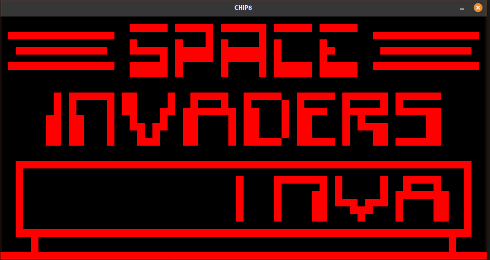

# Yet another CHIP8 Emulator written in Go

Fun little side project to learn how low level emulation stuff works.

This uses SDL2 as GFX/Input backend.
Implements function pointer map instead of an unreadable, gigantic switch statement.

---
